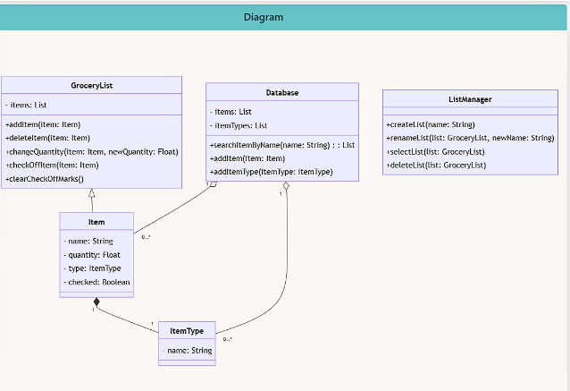
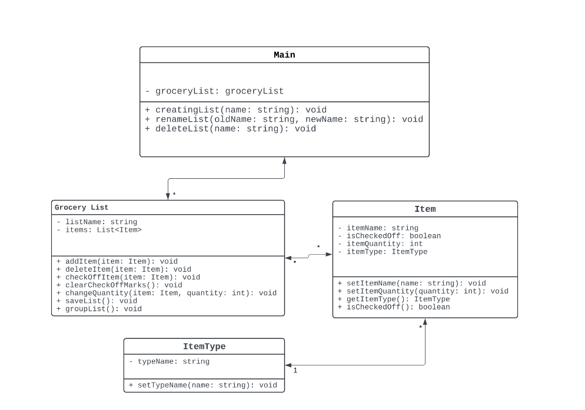
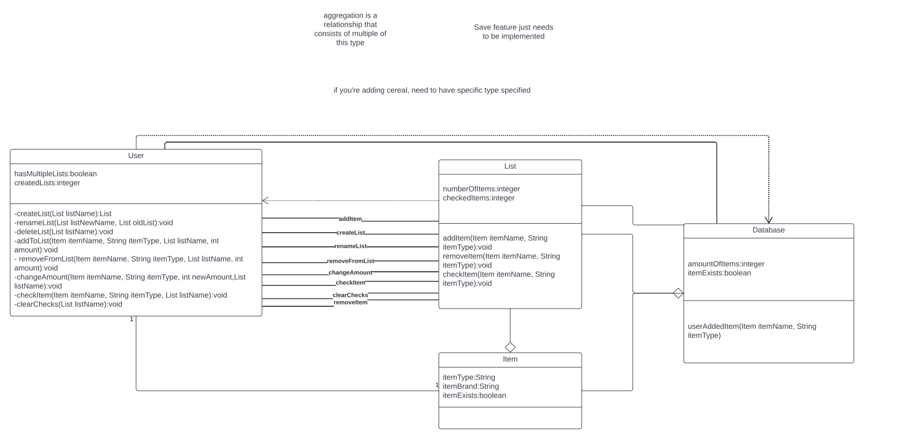
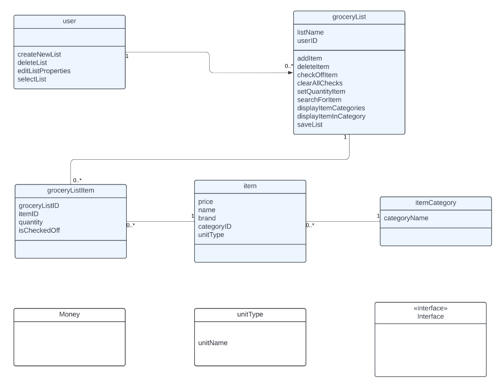
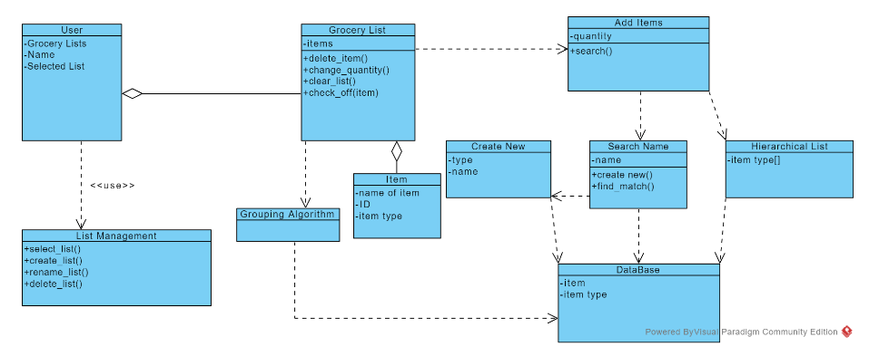
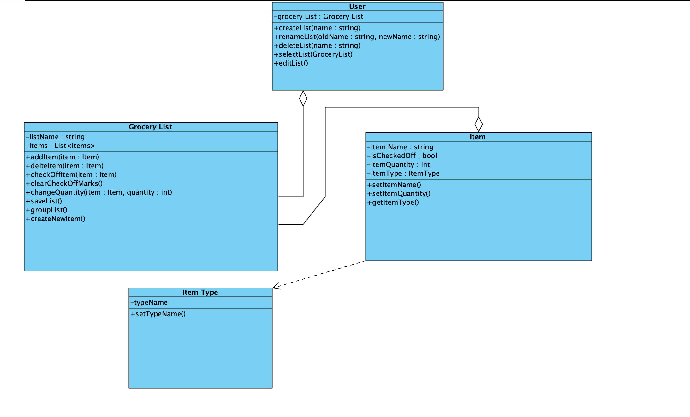

# Design 1

### PROS :

- Good considerations in terms of list management and database

### CONS :

- List Manager does not have a relationship with anything else.
- No clear implementation of multiple users
- Quantity of item not specific to list but item type, should be specific to each individual list.

# Design 2

### PROS :

- Simple and straighforward with each function's input and output types displayed

### CONS :

- Main should be named User to clear confusion

- Missing the ability to select list in Main

- Being able to edit a list's name might be important to include in Main

# Design 3

### PROS :

- Detailed descriptions of the variables.

- Simple classes involved with relationships shown clearly.

### CONS :

- Some classes are connected without a clear indicatior of their relationship.

# Design 4

### PROS :

- The database is in third normal form so it helps us ensure database integrity.

### CONS :

- The difference between groceryListItem and item is not intuitive at the start so it will take a bit to understand the database.

# Design 5

### PROS :

- The design incoroprates a database and has users to support multiple lists.

### CONS :

- The design becomes very confusing when it comes to items and item types/grouping.

# Team Design

- The team design's main commonality resides in similar functions that meet the requirement requested, and generally 3-4 main bodies that work together. There are also major differences between each design. Some designs like design5 break up important functions into more bodies that connect to each other rather having them grouped into a single body. Some designs like design3 have specific interactions between the bodies while other design's were a bit more general and vague. We decided to take the simplicity of some designs and while adding some functions that were missing.

####

# Summary

- Having to look at 5 different design, with some of them being very different from each other, communication with each group member was an important part of coming up with the final design. Knowledge sharing was also an important aspect as not everyone knows everything and being able to share that knowledge some individuals don't know or have overlooked is critical to a better overall design. Being able to communicate knowledge and sharing why one method is better than another progresses the design as well.
